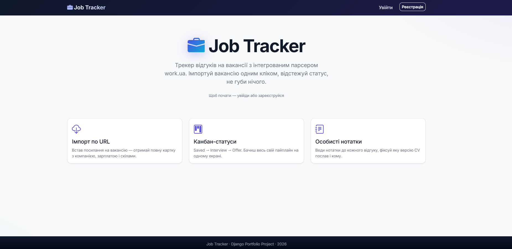
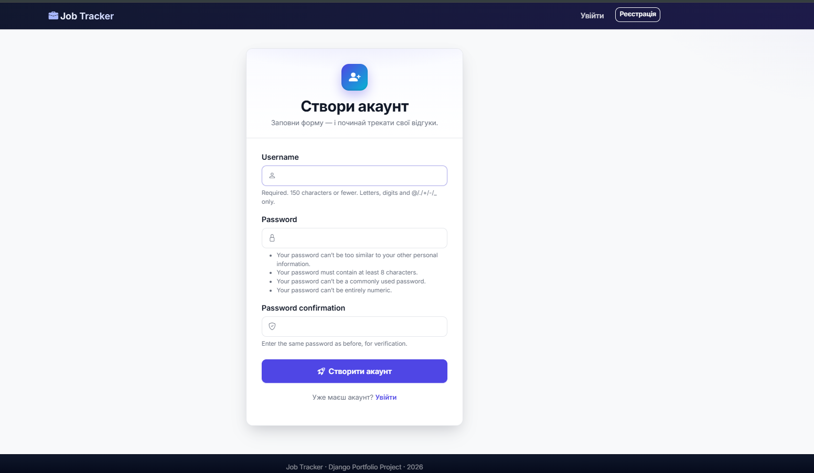
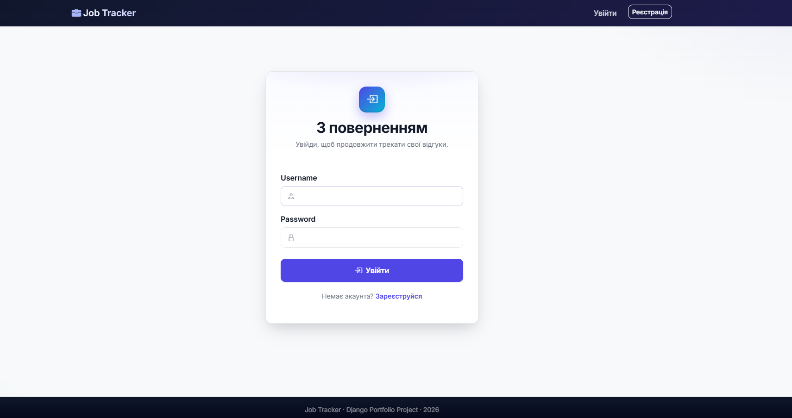
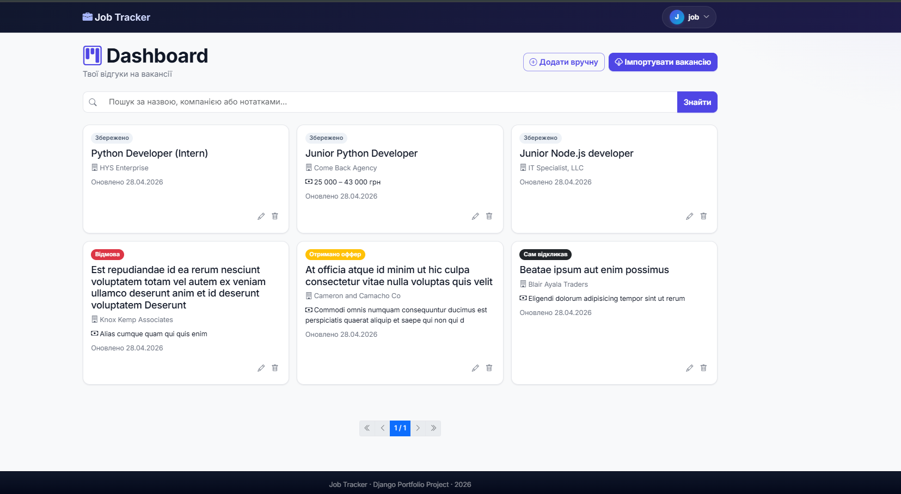
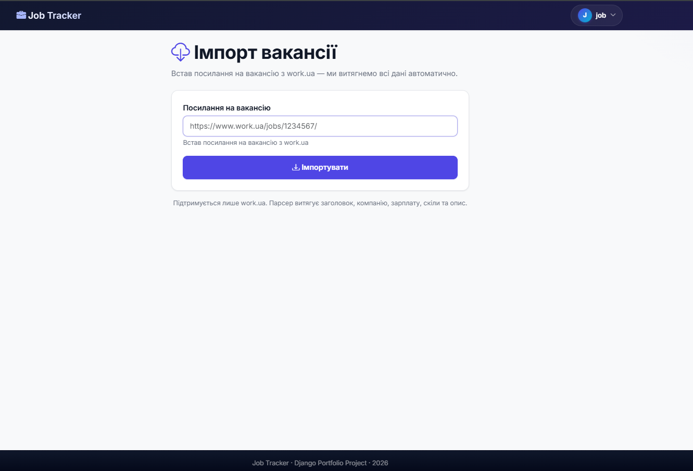
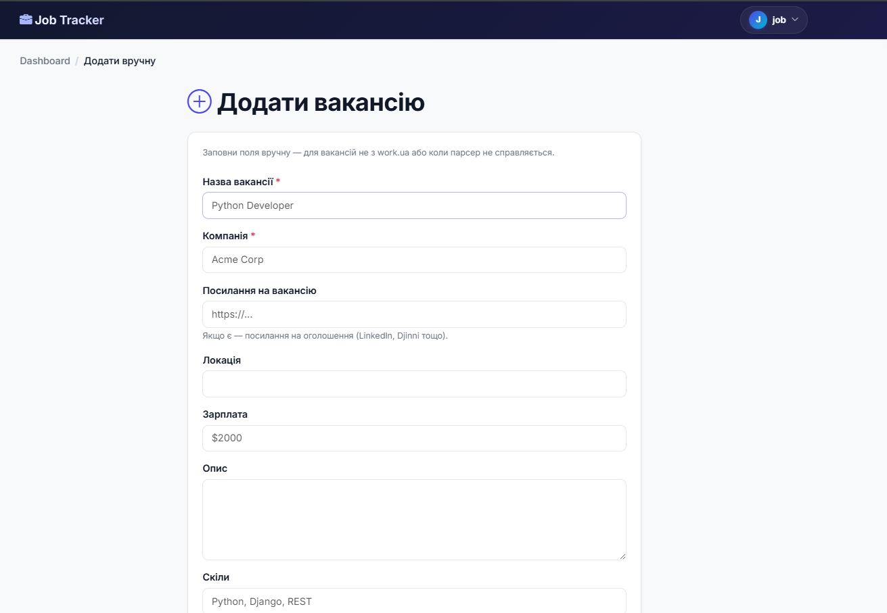
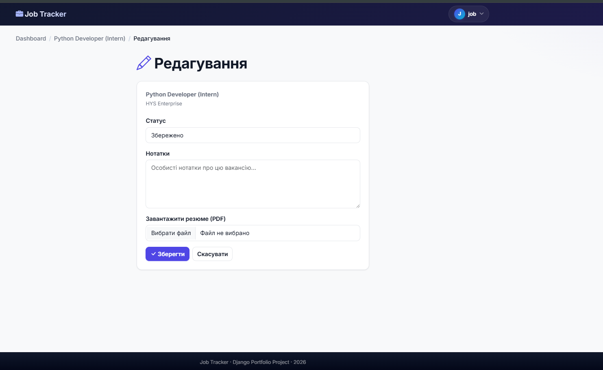
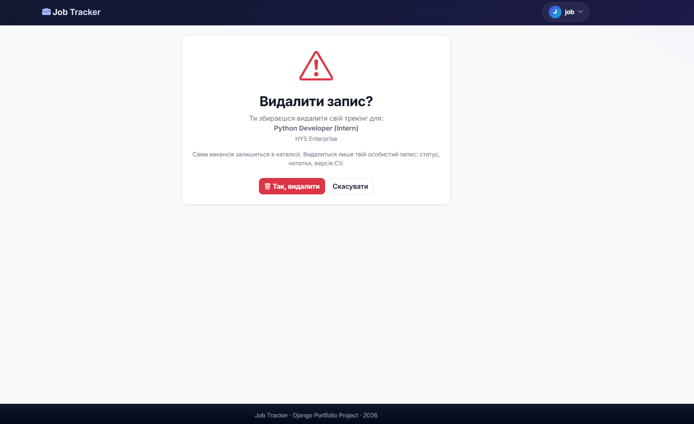
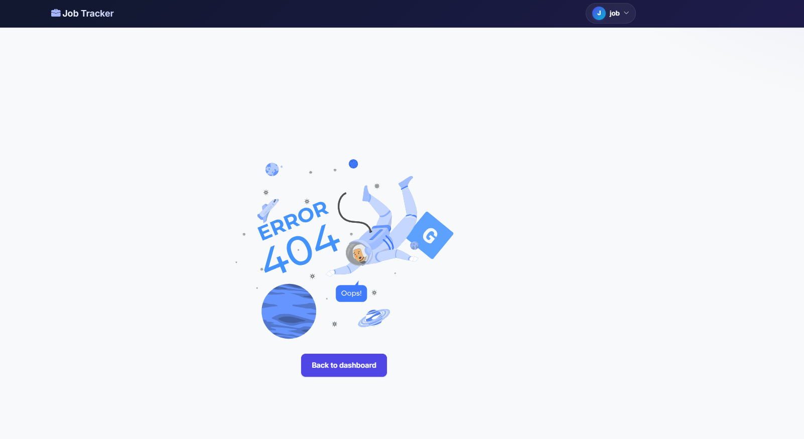

# Job Tracker

A Django web app for tracking job applications. Paste a vacancy URL from
work.ua and the app scrapes the listing, stores it, and lets you manage
your application status (saved → interview → offer → accepted/rejected).


## Features

- Built-in work.ua scraper — paste URL, get title, company, salary,
  skills, and description automatically
- Manual vacancy entry for sources outside work.ua
- Per-user application tracking with status, notes, and PDF resume upload
- Shared vacancy catalog — multiple users importing the same URL share
  one `Vacancy` record
- Search across titles, company names, and notes via GET parameter
- Pagination on the dashboard
- Authentication: registration with auto-login, login, logout, password
  change
- Owner-only edit and delete with 403 for unauthorized access
- SSRF protection on the import form (work.ua URLs only)
- Admin panel for all four models (Company, Skill, Vacancy, Application)

## Tech Stack

- Python 3.11+
- Django 6.0
- PostgreSQL (psycopg2-binary)
- Bootstrap 5 + Bootstrap Icons (CDN)
- requests + BeautifulSoup4 + lxml (scraper)
- python-decouple (env config)

## Installation

```bash
git clone https://github.com/example.git
cd job_tracker_project

python -m venv venv
venv\Scripts\activate          # Windows
# source venv/bin/activate     # Linux / macOS

pip install -r requirements.txt

cp .env.example .env
# fill in SECRET_KEY and database credentials

python manage.py migrate
python manage.py createsuperuser
python manage.py runserver
```

## Project Structure

```
config/         Django project settings
jobs/           Main app (models, views, forms, services, templates)
  services/     Framework-agnostic scraper and importer
templates/      Project-level templates (base.html, registration/)
static/         Static assets (CSS)
```

Open http://127.0.0.1:8000/ in the browser.

## Environment Variables

Configured via `.env` (not committed). See `.env.example` for the
template.

| Variable | Description |
|---|---|
| `SECRET_KEY` | Django secret key. Generate a new one for production. |
| `DEBUG` | `True` for development, `False` for production. |
| `ALLOWED_HOSTS` | JSON array of allowed hostnames, e.g. `["127.0.0.1","localhost"]`. |
| `DB_NAME` | PostgreSQL database name. |
| `DB_USER` | Database user. |
| `DB_PASSWORD` | Database password. |
| `DB_HOST` | Database host (usually `localhost`). |
| `DB_PORT` | Database port (default `5432`). |

## Screenshots

| Page | Preview |
|---|---|
| Home |  |
| Register |  |
| Login |  |
| Dashboard |  |
| Import vacancy |  |
| Create vacancy manually |  |
| Edit application |  |
| Delete confirmation |  |
| 404 page |  |


## Author

**Nazar Humen**
GitHub: [@NazarHumen](https://github.com/NazarHumen)
Email: nazargumen11@gmail.com

Built as a portfolio project for a Django course.
